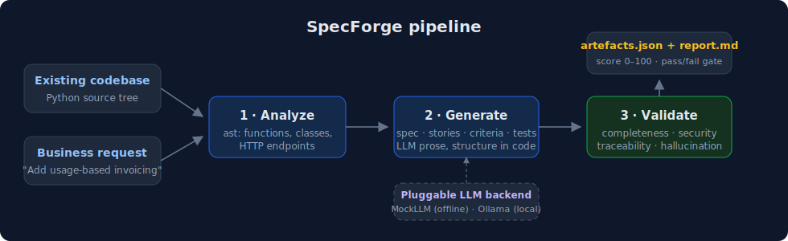
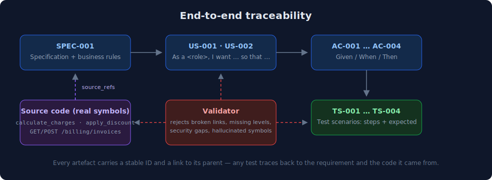

# SpecForge

Point it at a Python codebase and describe a change in plain English. It gives you
back a spec, user stories, acceptance criteria and test scenarios — all linked to
each other and to the actual code — and then runs a validation pass to catch the
stuff LLMs love to do: invent requirements, skip security, drop edge cases.

[](https://github.com/mohamed-abo-taha/spec-forge/actions/workflows/ci.yml)


## Why I built this

I kept seeing the same problem with LLM-generated specs and tests: they *look*
great and half of them reference functions that don't exist. So the idea here is
to split the job in two. The model only writes prose. The structure — IDs,
parent/child links, references to source symbols — is built in plain Python from
a real `ast` scan of the codebase. Then a separate, deterministic validator
checks the result and refuses to pass anything with broken links, hallucinated
symbols, or endpoints that nobody wrote a security requirement for.

No dependencies. The whole core is standard library. You can run it offline with
the built-in mock backend, or against a local Ollama model. Adding another
provider is one small class.



## Quick start

```bash
# see what's in a codebase
python -m specforge analyze examples/sample_app

# generate + validate artefacts, offline
python -m specforge run examples/sample_app \
  --request "Add usage-based invoicing for prepaid customers" \
  --out-dir out
```

```
Generated 2 stories / 4 criteria / 4 tests
Validation: PASSED  score=100/100  coverage=45%  issues=0
Wrote out/artefacts.json and out/report.md
```

There's a committed example in [`examples/output/`](examples/output/) if you
just want to see what the report looks like.

To use a local model instead of the mock (needs Ollama running on the default
port, nothing else):

```bash
python -m specforge run examples/sample_app --request "..." --llm ollama --model llama3.2:3b
```

If the model returns garbage JSON or the server is down, it falls back to the
structured mock output instead of crashing.

## How the pieces fit



Every artefact gets a stable ID (`SPEC-001`, `US-002`, `AC-003`, `TS-004`) and a
link to its parent, and each spec lists `source_refs` pointing at real symbols
found by the analyzer. So you can take any test scenario and walk it back to the
requirement and the code it came from.

## What the validator catches

- **Completeness** — a spec with no stories, a story with no criteria, a criterion with no test
- **Traceability** — anything referencing a parent ID that doesn't exist
- **Hallucination** — backticked identifiers or source refs that aren't actually in the codebase
- **Security** — the codebase exposes HTTP endpoints but no artefact says a word about auth or input validation

Output is a 0–100 score plus a markdown report with the full traceability tree.
Any high-severity issue fails the run (exit code 1), so you can drop it straight
into CI as a gate.

## Commands

```
specforge analyze  PATH [--json]
specforge generate PATH --request "..." [--llm mock|ollama] [--out FILE]
specforge validate --artefacts FILE --code PATH [--report FILE]
specforge run      PATH --request "..." [--out-dir DIR]
```

`python -m specforge ...` works without installing anything. `pip install -e .`
gets you the `specforge` command.

## Layout

```
specforge/
├── analyze.py    ast scan -> functions, classes, HTTP endpoints
├── llm.py        backends: MockLLM (offline), OllamaLLM (urllib, no SDK)
├── generate.py   builds the artefact tree; structure owned in code, not by the model
├── validate.py   deterministic checks + scored report
├── models.py     dataclasses for everything
└── cli.py
```

## Tests

```bash
python -m unittest discover -s tests -v
```

15 tests, stdlib only. CI runs them on 3.9 / 3.11 / 3.12 plus a CLI smoke test.

## Things I might add

- analyzers for other languages (probably tree-sitter)
- export to Jira / Azure DevOps work items
- a diff mode: only regenerate artefacts affected by a code change

## License

MIT
